# Single-Agent and Multi-Agent Pathfinding Using A*, Conflict-Guided Coordination, and Decentralized Negotiation

## Artificial Intelligence: CSMI17 Assignment 2

| Team member | Roll number |
| --- | --- |
| Mohd. Kaif | 114123050 |
| Pradyumna Kaushal | 114123065 |
| Ujjwal Sinha | 103123118 |

## Abstract

We implement shortest-path search on static grids and extend it to concurrent robot trajectories. Question 1 compares Manhattan, Euclidean, Chebyshev and Zero/Dijkstra using canonical A*. Question 2 compares independent planning, fixed-priority Space-Time A*, conflict-guided initial ordering and bounded priority promotion. An experimental extension uses per-robot controllers, explicit peer messages and local reserved replanning. We evaluate paired randomized scenarios: 400 single-agent scenarios, 360 centralized multi-agent scenarios and a separate 80-scenario decentralized pilot. All Q1 heuristics return identical optimal costs. Centralized full CG achieves 359/360 safe plans; the decentralized pilot achieves 77/80, versus 79/80 for full CG on the same pilot inputs. These measurements describe finite-budget implementations under the stated sampling assumptions; they do not establish completeness, joint optimality or a general decentralized advantage.

## 1. Problem definition and objectives

**Question 1.** Given a rectangular grid, static obstacles and distinct free start/goal cells, find a minimum-cost path. We compare heuristic guidance while holding the implementation and each trial's input fixed. The UI exposes actual expansion, frontier and final path states.

**Question 2.** Given several start/goal pairs, plan trajectories for simultaneous discrete-time execution. Individually shortest paths may be unsafe together. A vertex collision occurs when robots occupy the same cell at the same timestep; an edge-swap collision occurs when two robots exchange cells in one timestep. Coordination must consider both, including occupied goals after arrival.

**Extension.** We demonstrate simulated decentralized conflict negotiation with private controller state and receiver-addressed messages. This is a coursework adaptation of established search and coordination ideas, rather than a claim of new research [1-3].

## 2. Movement assumptions

Cells have integer coordinates. Robots move to free orthogonal neighbors with unit cost. Space-Time A* also allows a unit-cost WAIT. Obstacles do not change, robots know the common map, and arrivals permanently occupy their goals. Simulation holds early arrivals until the last arrival. Robots share spatial cells safely at different times. There is no diagonal movement, continuous geometry, uncertainty, sensing or physical robot/network implementation.

<!-- page: portrait -->
## 3. Single-agent A* and heuristics

Canonical A* orders frontier states by **f(n) = g(n) + h(n)**. The best known start-to-state cost is g; parent links reconstruct the solution. Stale heap entries are discarded. Equal f values use insertion order. An improved g can reopen a state, so exploration history is not permanent exclusion. All four heuristics use exactly this implementation [1].

<!-- image-height: 325 -->
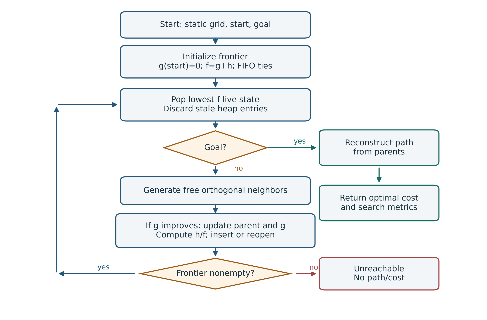

Figure 1. Implemented A* workflow. Frontier exhaustion returns an unreachable result with missing path cost. A goal pop returns the reconstructed path and measured search counters.

| Heuristic | Estimate for absolute coordinate differences dx, dy |
| --- | --- |
| Manhattan | dx + dy |
| Euclidean | sqrt(dx^2 + dy^2) |
| Chebyshev | max(dx, dy) |
| Zero / Dijkstra | 0; Uniform-Cost Search baseline |

All four estimates are admissible and consistent for this four-connected unit-cost model. Manhattan is the obstacle-free distance; the other estimates never exceed it. We therefore expect equal optimal path costs on solvable maps, although tied optimal paths may differ. Obstacles can make every estimate underestimate actual distance. Manhattan provides stronger guidance here, motivating expansion comparisons without treating tiny runtime differences as decisive speed improvements.

Selecting another heuristic preserves the scenario. Q1 experiments explicitly assert equal returned path costs within each accepted paired trial.

<!-- page: portrait -->
## 4. Centralized multi-agent coordination

**Independent A*.** Each robot computes a Manhattan A* path while ignoring peers. We then check the joint trajectories. Individual pathfinding success and complete collision-free success are separate outcomes.

**Fixed-Priority ST-A*.** Robots plan in ascending ID order. States are (cell, time); successors include moves and WAIT. A shared reservation table excludes occupied vertices at arrival, reverse traversals of reserved edges and permanently held goals. Terminal arrival must permit staying at the goal without future reservation conflict. Independent preprocessing remains in the measured pipeline. Space-time search, reservations and prioritized coordination are established techniques [2].

**Conflict-guided ordering, without promotion.** Independent trajectories provide C_i, predicted collision events involving robot i; B_i, initial path positions with static free-cell degree at most two, including endpoints; and L_i, independent path cost. A multi-robot vertex event contributes once to every involved robot. B is low-degree exposure, not an articulation-point test. The initial order sorts **(-C_i, -B_i, -L_i, agent ID)**. A failed order ends this ablation method.

**Full CG-ST-A*.** CG uses the same initial ordering and searches. An eligible failure promotes the first failed robot, usually one position earlier. Already tried orders are skipped; paths/reservations clear and the whole order restarts. A larger advance can skip repeated orders. Successful ordinary planning needs no promotion.

<!-- image-height: 235 -->
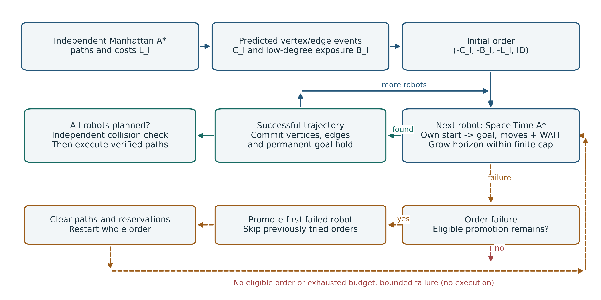

Figure 2. Solid arrows show ordinary reservation planning; the dashed branch is optional bounded promotion after failure. Unsuccessful planning never enters execution.

Let F be free-cell count and Lmax the longest independent cost. Default horizon cap is **F + Lmax**. Initial horizon min(cap, L_i) doubles after exhaustion, with a minimum of one, up to the cap. The cumulative 100,000 Space-Time expansion budget covers retries and order restarts; independent preprocessing is reported outside it. Full CG permits at most 2N additional orders. Promotion counts positions advanced. Finite bounds can cause failure without proving joint infeasibility. These planners are not complete or globally optimal for SOC or makespan.

<!-- page: portrait -->
## 5. Decentralized architecture

DCN-ST-A* gives each `RobotController` its own ID/endpoints, path/version, search, inbox, peer advertisements, conflicts, agreement state, reservation table and counters. It receives the immutable obstacle map and peer IDs. Other trajectories arrive only through immutable messages; controllers do not inspect peers' mutable state or invoke the centralized planner.

<!-- image-height: 260 -->
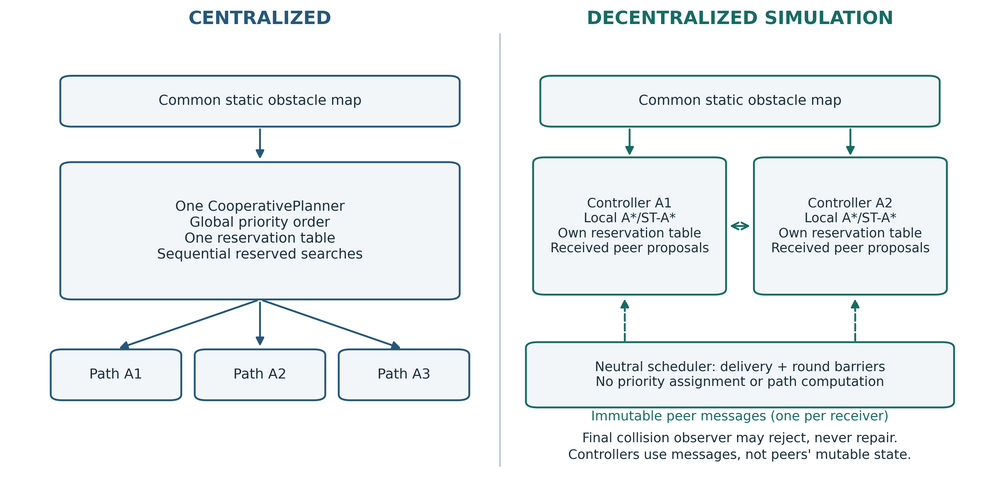

Figure 3. Central CG has a global order and shared table. DCN controllers build private tables from received proposals. A neutral scheduler delivers messages and enforces barriers; its final observer can reject trajectories but cannot repair them.

The scheduler steps searches round-robin in sequential Python. It simulates synchronous decisions and reliable all-to-all communication. Logical rounds do not represent network delay or parallel hardware execution. There is no packet loss, radio range or asynchronous transport. Prior work investigates decentralized prioritized coordination [3]; our protocol is a bounded educational implementation.

<!-- table-widths: 28,72 -->
| Message | Actual payload and purpose |
| --- | --- |
| PATH_PROPOSAL | Initial immutable trajectory and fixed local priority key |
| UPDATED_PATH | Revised trajectory, higher sender version and unchanged key |
| CONFLICT_NOTICE | Predicted collision details and two proposal versions |
| YIELD_DECISION | Pair winner and associated proposal versions |
| AGREEMENT | Complete sorted (agent ID, proposal version) vector |
| PLANNING_FAILURE | Local stopping reason |

Every broadcast creates one queue entry per other receiver. Sent counts these entries; delivered counts arrivals in inboxes. Delivery occurs at the next barrier while active. Outgoing messages queued at termination are **pending**, not lost packets. Success can leave redundant final agreements; failure can also leave proposals or failure notices. Centralized communication is N/A, not a zero-message transport baseline.

<!-- page: portrait -->
## 6. Local negotiation and agreement

Round 0 computes each independent Manhattan path and broadcasts version 1. Later rounds receive advertisements and detect own-path conflicts. A conflicting pair independently chooses the smaller **(-initial B, -initial L, agent ID)** tuple. Keys stay fixed across revisions. Notices and decisions expose the local decision; replanning does not wait for separate acknowledgement.

<!-- image-height: 310 -->
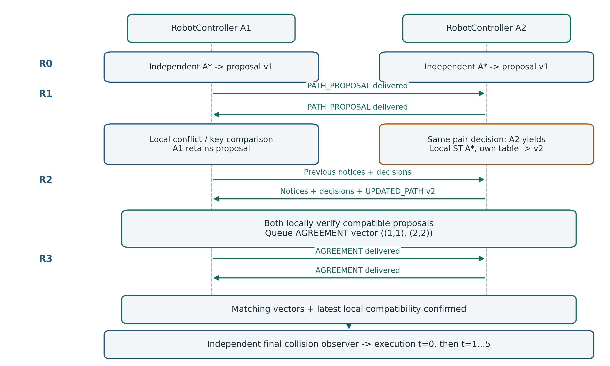

Figure 4. Actual crossing demo: A1 keeps its proposal; A2 replans with one WAIT and publishes v2. Matching vectors follow in later rounds. R0-R3 precede execution timesteps t=0 through t=5.

A controller losing any pair builds a fresh private reservation table from **all received superior peers**, including nonconflicting paths. Existing Space-Time A* replans its own route. Success increments its version and publishes an update. Cached proposals change only for a strictly greater version and a no-earlier round. Duplicate versions cannot change trajectory/key. Stale notices cannot command changes because decisions use current advertisements.

Agreement requires complete information, local compatibility, matching vectors received from every peer and a fresh compatibility check. Once all controllers agree, the independent final collision check accepts or rejects the plan. Failure returns no executable paths and missing solution quality.

Defaults are 32 rounds including R0 and 100,000 cumulative expansions **per controller**, including initial A*. Horizon cap is F plus maximum initial advertised cost. Replans grow horizons within that cap. Stops include round/effort exhaustion, blocked/horizon-exhausted search, unreachable initial paths and repeated proposals. Repeat detection conservatively aborts an earlier route even when changed constraints might make it useful again. Stable pair ordering does not guarantee convergence or feasibility.

<!-- page: portrait -->
## 7. Experimental methodology and metrics

**Paired randomized design.** Different trials consume different seeds; all methods within a trial receive identical obstacles and endpoints. Effective seed = **base seed + global candidate index**, starting at zero. The counter advances for rejected candidates and across conditions. The same ordered configuration and seed reproduce the scenario. Distinct seeds normally vary layouts but do not guarantee uniqueness. Deterministic fingerprints, scenario IDs and seeds remain in CSVs/manifests.

Grid generation reserves two distinct endpoints and independently blocks other cells with fixed nominal p; realized density varies. Q1 rejects disconnected pairs and reports **conditional-on-reachability** performance. Q2 shuffles component cells, pairs them and samples disjoint endpoints: every pair is reachable and all 2N endpoints are distinct. This is not uniform over every reachable assignment. Endpoint-capacity failure rejects generation candidates; coordinated success and predicted conflicts never filter accepted Q2 inputs. Method execution order rotates across scenarios.

<!-- table-widths: 15,24,17,16,14,14 -->
| Dataset | Grid sizes | p | Agents | Trials / condition | Scenarios / runs |
| --- | --- | --- | --- | --- | --- |
| Q1 | 20x20, 40x30 | 0.2, 0.3 | 1 | 100 | 400 / 1,600 |
| Central Q2 | 10x10, 20x20, 30x30 | 0.1, 0.2, 0.3 | 2, 4, 6, 8 | 10 | 360 / 1,440 |
| DCN pilot | 10x10, 20x20 | 0.1, 0.3 | 2, 4, 6, 8 | 5 | 80 / 400 |

Table 1. Saved datasets. Q1 base 123 yields accepted seeds 123-549 with 27 rejections. Both multi-agent datasets use base 42: central seeds 42-401 and pilot 42-121, without rejections. Each dataset has as many distinct fingerprints as accepted scenarios.

**Metrics.** Expanded counts valid pops, including goals. Generated counts successor insertions after initialization; improved/reopened insertions may count again. Peak frontier is maximum live OPEN size, a memory proxy rather than bytes. Q2 effort includes independent preprocessing and coordinated retries. Path cost counts actions; SOC sums arrival costs; makespan is latest arrival; WAIT counts stationary actions before arrival, excluding permanent goal holding.

**Aggregation.** Success rates include every accepted scenario. Means, medians and sample SD use available values with counts; missing is not zero. Failed cooperative quality is missing. Paired quality differences use both-success inputs and second minus first. All-run effort/time includes failure. SD error bars describe scenario variability, not confidence intervals. We claim no statistical significance or population-wide superiority.

**Timing/budgets.** `perf_counter` excludes UI delay/rendering. DCN includes active messaging, detection, search and final verification. Central methods share 100,000 Space-Time expansions; DCN grants 100,000 per robot including initial A*. Pilot budgets are thus unequal in aggregate. The two primary benchmark processes briefly overlapped during collection; timings are descriptive and sensitive to scheduling, especially below one millisecond.

<!-- page: landscape -->
## 8. Q1 results: 100 paired reachable trials per condition

<!-- table-widths: 28,12,12,12,12,12,12 -->
| Condition / heuristic | Expanded mean | Median | SD | Generated mean | Peak frontier mean | Mean ms |
| --- | --- | --- | --- | --- | --- | --- |
| 20x20, p=0.2: Manhattan | 46.11 | 34 | 45.26 | 62.25 | 18.20 | 0.147844 |
| 20x20, p=0.2: Euclidean | 57.99 | 43 | 57.05 | 72.83 | 18.54 | 0.183809 |
| 20x20, p=0.2: Chebyshev | 67.79 | 53.5 | 61.72 | 83.44 | 18.69 | 0.219159 |
| 20x20, p=0.2: Zero / Dijkstra | 155.01 | 157 | 97.27 | 166.52 | 19.09 | 0.447987 |
| 20x20, p=0.3: Manhattan | 48.09 | 35 | 43.56 | 61.32 | 15.09 | 0.148467 |
| 20x20, p=0.3: Euclidean | 58.09 | 41.5 | 49.44 | 70.16 | 15.40 | 0.177420 |
| 20x20, p=0.3: Chebyshev | 67.13 | 52.5 | 53.16 | 79.54 | 15.90 | 0.205336 |
| 20x20, p=0.3: Zero / Dijkstra | 135.37 | 130 | 76.13 | 144.15 | 15.98 | 0.377588 |
| 40x30, p=0.2: Manhattan | 95.16 | 73.5 | 78.47 | 124.94 | 30.97 | 0.311319 |
| 40x30, p=0.2: Euclidean | 140.57 | 106 | 126.82 | 169.47 | 33.09 | 0.477854 |
| 40x30, p=0.2: Chebyshev | 171.47 | 133 | 147.53 | 202.63 | 33.80 | 0.565731 |
| 40x30, p=0.2: Zero / Dijkstra | 450.38 | 439 | 253.81 | 475.08 | 34.08 | 1.355711 |
| 40x30, p=0.3: Manhattan | 121.70 | 96.5 | 99.33 | 146.52 | 25.60 | 0.378220 |
| 40x30, p=0.3: Euclidean | 165.10 | 130 | 132.78 | 186.77 | 26.82 | 0.503937 |
| 40x30, p=0.3: Chebyshev | 191.58 | 158.5 | 146.53 | 214.90 | 27.19 | 0.575948 |
| 40x30, p=0.3: Zero / Dijkstra | 408.56 | 408.5 | 215.46 | 426.79 | 27.77 | 1.172403 |

Table 2. Every row has n=100, success=100% under reachability conditioning. Expansion columns are mean, median and sample SD; generated/frontier columns are means. Runtime is mean milliseconds. Every paired optimal cost agrees: mean/median cost is 14.13/14 (20x20, p=0.2), 16.70/15 (20x20, p=0.3), 23.57/22 (40x30, p=0.2), and 28.79/27 (40x30, p=0.3).

<!-- image-height: 170 -->
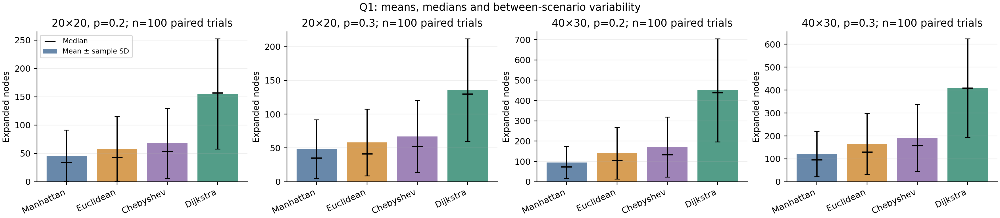

Figure 5. Mean/median expanded nodes and sample SD for four saved conditions. Variation is between scenarios, not repeated timings of one map. Manhattan has the lowest mean expansions here. Stronger obstacle-free guidance explains the measured pattern.

<!-- page: portrait -->
## 9. Central Q2 success and paired comparisons

<!-- table-widths: 38,17,17,28 -->
| Method | Safe / 360 | Rate | Mean expanded / ms, all runs |
| --- | --- | --- | --- |
| Independent A* | 176 | 48.89% | 265.29 / 2.52 |
| Fixed-Priority ST-A* | 351 | 97.50% | 1,811.39 / 24.36 |
| CG, no promotion | 354 | 98.33% | 1,805.98 / 25.20 |
| Full CG-ST-A* | 359 | 99.72% | 1,993.10 / 26.44 |

Table 3. Identical 360 inputs. Independent finds every individual path, but 184 joint plans are unsafe, with 373 vertex and 87 edge-swap events total. Successful reserved plans have zero collisions.

<!-- image-height: 205 -->
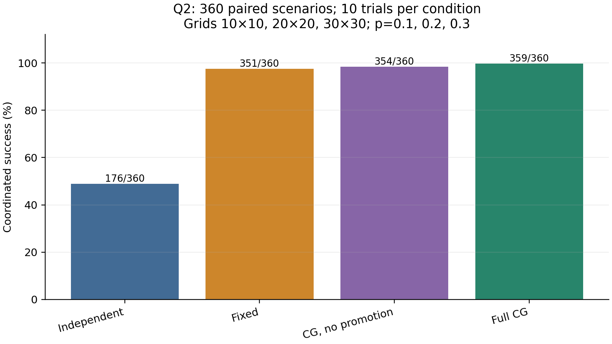

Figure 6. Complete safe-plan counts; failures remain in the denominator.

<!-- table-widths: 40,15,15,15,15 -->
| Paired mechanism comparison | Both safe | First only | Second only | Both fail |
| --- | --- | --- | --- | --- |
| Independent -> Fixed: reservations | 176 | 0 | 175 | 9 |
| Fixed -> no promotion: initial order | 349 | 2 | 5 | 4 |
| No promotion -> full CG: promotion | 354 | 0 | 5 | 1 |

Table 4. Shared-input success discordance. Ordering has five recoveries and two losses, net three. Promotion recovers five without losing an initial-order success.

<!-- table-widths: 38,10,13,13,13,13 -->
| Second minus first, both safe | n | Mean SOC | Mean makespan | Mean WAIT | Mean expanded |
| --- | --- | --- | --- | --- | --- |
| Fixed - Independent | 176 | 0 | 0 | 0 | +393.84 |
| No promotion - Fixed | 349 | +0.610 | -0.169 | +0.656 | +60.53 |
| Full CG - no promotion | 354 | 0 | 0 | 0 | 0 |

Table 5. Median quality differences are zero throughout. Successful-method averages alone mix different inputs. Identical deterministic results in the last row do not make its roughly -0.02 ms mean timing difference meaningful.

<!-- page: landscape -->
## 10. Central Q2 ablation and remaining failure

<!-- image-height: 245 -->
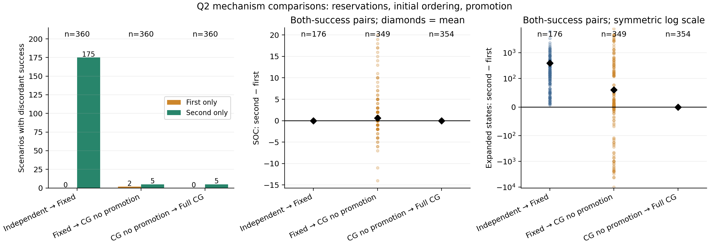

Figure 7. Discordance uses all 360 scenarios; quality/effort differences use both-success pairs, n=176/349/354. Diamonds are means; expansion differences use a symmetric logarithmic scale. Raw pairs retain individual gains and losses.

**Conflict-heavy cases.** Of 54 inputs with at least three independent collision events, Fixed succeeds on 48, no-promotion on 50 and full CG on 54. These overlapping subsets belong to the original random sample, not new experiments. Their counts support inspection without establishing universal benefit.

**Adaptation.** Six scenarios invoke promotion: five recover and one remains unsuccessful. Fourteen positions are advanced. All 360 full-CG runs total 374 whole-order attempts. Counts include attempted adaptation on failure; 14 promotions do not mean 14 recovered scenarios.

**Remaining failure.** Seed 397, scenario `s2-p2-a8-t0005`, fails after Agent 3 exhausts its horizon with no new eligible order. Individual reachability does not establish joint feasibility. Original 1,080 rows for Independent, Fixed and full CG match the earlier 360-scenario benchmark on deterministic fields; elapsed time and run order are excluded from historical comparison.

Reservations account for the largest observed success improvement. Ordering changes which inputs can be solved; promotion recovers some unfavorable orders at added search cost. We claim neither minimum joint SOC nor a general ranking theorem.

<!-- page: portrait -->
## 11. Separate decentralized pilot

<!-- table-widths: 31,15,14,13,13,14 -->
| Method | Safe / 80 | Rate | Mean SOC, safe | Mean makespan, safe | Median ms, all |
| --- | --- | --- | --- | --- | --- |
| Independent A* | 29 | 36.25% | 33.93 | 15.17 | 0.65 |
| Fixed-Priority ST-A* | 73 | 91.25% | 57.10 | 17.68 | 2.82 |
| CG, no promotion | 77 | 96.25% | 58.21 | 17.52 | 3.34 |
| Full CG-ST-A* | 79 | 98.75% | 59.30 | 17.70 | 3.35 |
| DCN-ST-A* | 77 | 96.25% | 58.69 | 17.30 | 7.15 |

Table 6. Quality means use each method's own safe subset, n=29/73/77/79/77, not paired improvements. The 51 unsafe independent pilot cases have missing coordinated quality.

<!-- image-height: 175 -->
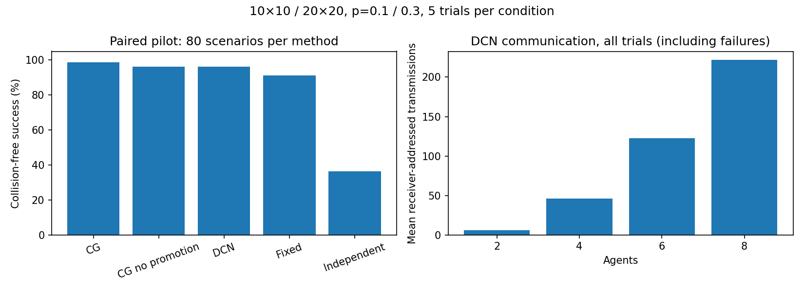

Figure 8. Separate pilot: 80 scenarios, 400 runs. DCN messages count actual receiver-addressed queue entries, including failure runs. Centralized transport is N/A.

| DCN overhead, all 80 | Total | Mean | Range |
| --- | --- | --- | --- |
| Completed rounds | 294 | 3.675 | 2-6 |
| Messages sent | 7,931 | 99.14 | 6-369 |
| Messages delivered | 5,926 | 74.08 | 4-313 |
| Local replans | 108 | 1.35 | 0-10 |

Table 7. Median rounds=4; 2,005 outgoing messages remain pending at termination, not lost packets.

For **77 shared successes with full CG**, mean DCN-minus-CG differences are SOC +0.026, makespan -0.195, WAIT +0.078, expanded -733.86 and time +6.83 ms. Median quality differences are zero; median time difference is +2.65 ms. All-run mean time is 97.85 ms for DCN versus 33.47 ms for CG; hard failures dominate means. Unequal aggregate budgets and sequential execution prevent architectural speedup claims.

| DCN failure seed | Actual reason |
| --- | --- |
| 80 | local_reservation_blocked:reservation_blocked |
| 111 | no_progress:repeated_proposal |
| 117 | local_search_limit |

Table 8. Failure quality is missing, not zero. CG has one pilot search-budget failure; Fixed has seven failures and no-promotion has three. All remain in success/effort aggregates.

<!-- page: landscape -->
## 12. Live UI evidence: Q1 search

<!-- image-height: 405 -->
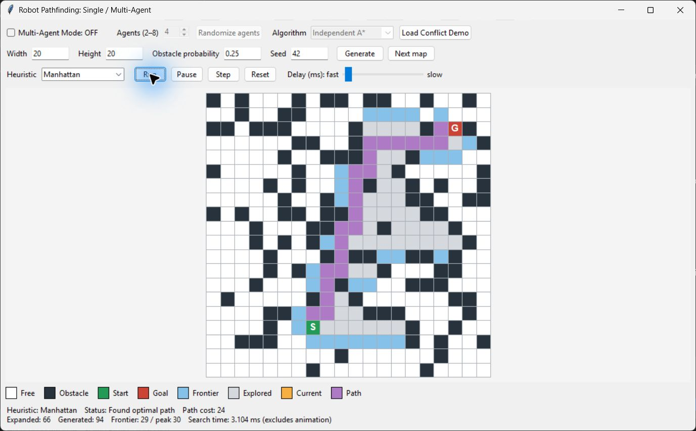

Figure 9. Unmodified running-app capture: 20x20, nominal p=0.25, seed 42, Manhattan. Optimal path cost 24; 66 expansions. This illustration is separate from final p=0.2/0.3 experiments. Obstacles, endpoints, explored cells, frontier and route come from actual state. UI animation time is not benchmark computation time.

Generate reconstructs the configured seed; Next Map advances it. Heuristic switching preserves the scenario. Run, Pause, Step and Reset control playback.

<!-- page: landscape -->
## 13. Live UI evidence: unsafe independent trajectories

<!-- image-height: 405 -->
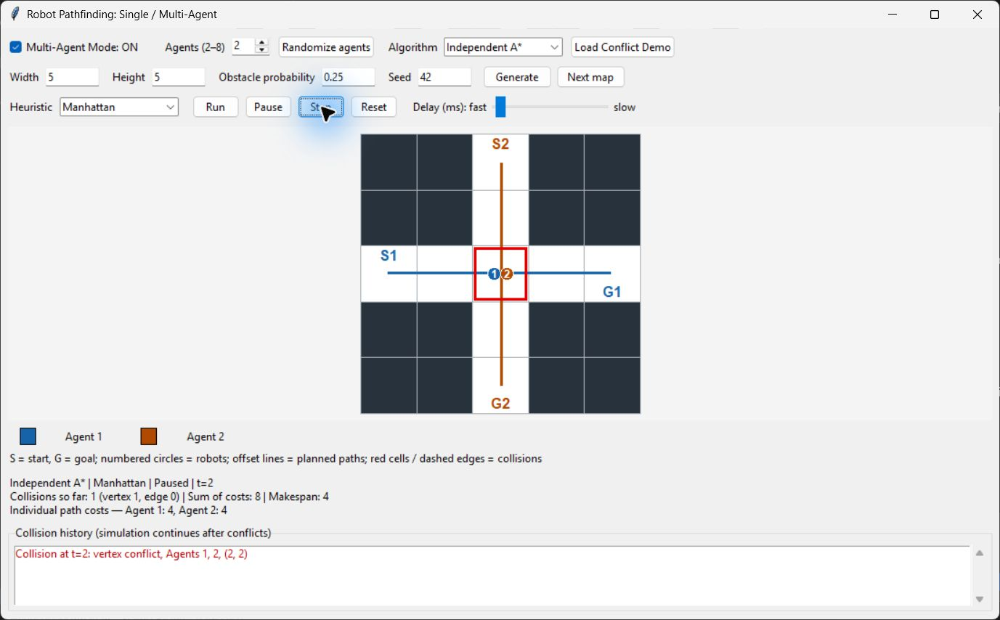

Figure 10. Hand-built 5x5 crossing demo, Independent A*, two robots at t=2. Both occupy (2,2), a vertex collision. Individual paths have SOC 8/makespan 4, but are jointly unsafe. Retained probability/seed controls govern subsequent random generation, not this preset.

Switching planner preserves the loaded map and agent pairs. Randomize Agents advances the agent seed while preserving obstacles; Generate/Next Map generate maps from the controls.

<!-- page: landscape -->
## 14. Live UI evidence: conflict analysis and initial ranking

<!-- image-height: 405 -->
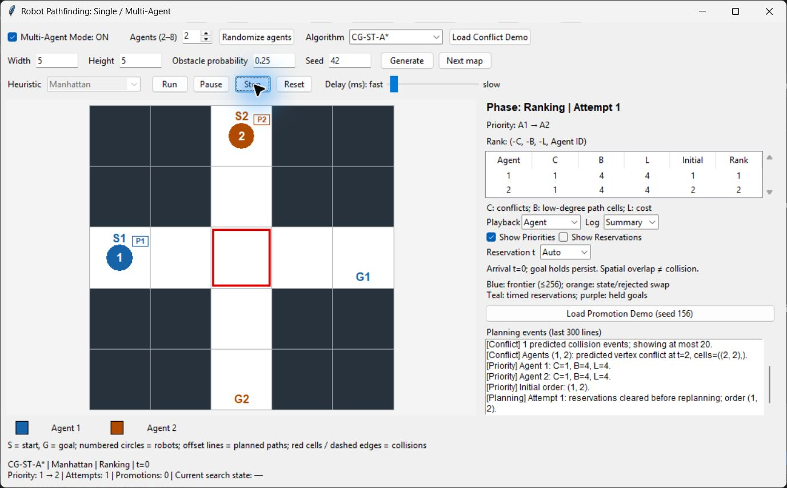

Figure 11. Same conflict preset under CG: each agent has C=1, B=4, L=4. ID breaks the tie, yielding order (1,2). The red intersection is predicted before execution. The priority table and real event log expose planner analysis.

The first path reserves the crossing at t=2; the second robot can WAIT and cross later. Final CG demo: SOC 9, makespan 5, one WAIT, zero collisions. A preserved reservation checkpoint is in `docs/screenshots/q2_reservations.png`.

<!-- page: landscape -->
## 15. Live UI evidence: bounded priority promotion

<!-- image-height: 405 -->
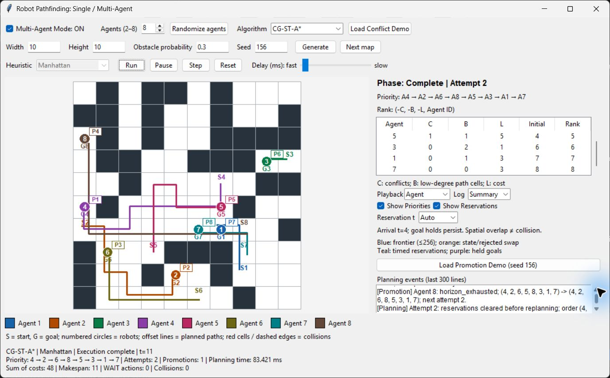

Figure 12. Deterministic 10x10, p=0.3, seed 156, eight-agent preset. The log records Agent 8 advancing from rank 5 to 4 and clearing paths/reservations for attempt 2. Initial order (4,2,6,5,8,3,1,7); final (4,2,6,8,5,3,1,7). Execution finishes with SOC 48, makespan 11, WAIT 0 and no collision.

This example demonstrates recovery from one initial-order failure; promotion is not needed on every success. Search observers expose actual decisions while preserving deterministic outcomes.

<!-- page: landscape -->
## 16. Live UI evidence: decentralized messages and revision

<!-- image-height: 405 -->
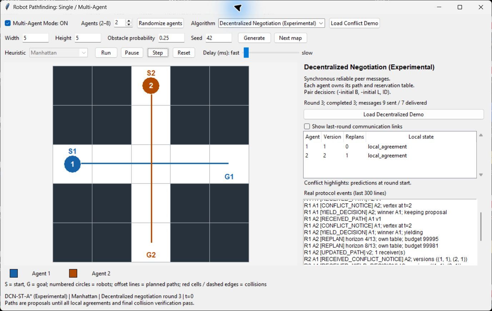

Figure 13. Live capture after R2 (three completed rounds including R0): nine messages sent/seven delivered. A1 remains at v1; A2 has v2 after one local replan. The scrolled real log shows R1 notices, pair decisions, A2's own-table horizon retries and UPDATED_PATH. Both have local agreement, but peer-vector confirmation is pending; execution remains at t=0.

One more round confirms vectors and final collision checking. Completed demo: four rounds, 11 sent/nine delivered, one replan, one WAIT, SOC 9, makespan 5, zero collisions. Two redundant outgoing agreements remain queued. Predicted proposal conflicts are not executed collisions.

<!-- page: portrait -->
## 17. Validation, limitations and conclusion

We recomputed saved statistics and regenerated manifest scenarios. Q1 has 400 distinct accepted seeds/fingerprints, 1,600 runs and equal optimal costs. Central Q2 has 360 distinct seeds/fingerprints and 1,440 runs; original 1,080 deterministic rows match preserved history. The pilot has 80 distinct seeds/fingerprints, 400 paired runs and verified aggregates. Final formatting did not rerun full benchmarks or overwrite historical datasets or existing selected figures/screenshots.

Final tests: **204 passed, 1 skipped, 0 failed**. The skipped Tk initialization case passed individually on retry (**1 passed**). Coverage includes reproduction, trial variation, pairing, optimal costs, CSV metadata, missing-result statistics, reservations, goals, collisions, horizons, promotion, controller ownership, message order, version vectors, failure and UI state. Compilation and diff checks pass. Native captures complement tests. PDF pages are rendered and visually checked before publication.

The samples condition on individual reachability. Finite prioritized planning can fail on feasible inputs and need not minimize joint cost. DCN assumes a common static map and reliable synchronous communication, conservatively rejects repeated proposals and executes sequentially. Pending messages are not loss measurements. Pilot size, unequal budgets and platform-sensitive timings limit architectural comparisons.

We find that admissible Q1 heuristics preserve optimal cost while changing effort. Reservations greatly improve measured safe success; ordering and promotion add recoveries. DCN demonstrates local state, explicit messages, revised proposals and safe execution with communication overhead and real failures. We claim no completeness, guaranteed convergence, globally optimal multi-agent cost or hardware speedup.

## 18. Source code and reproduction

GitHub: [Artificial-Intelligence-Multi-Robot-Path-Finding-Problem](https://github.com/pradykst/Artificial-Intelligence-Multi-Robot-Path-Finding-Problem). README supplies installation, smoke/final benchmarks, seeds, metrics and artifact generation. Full run directories remain ignored; committed figures preserve evidence. Reproduce into fresh directories. Publication does not submit the assignment to the instructor.

```text
python -m pip install -r requirements.txt
python main.py
python examples/cooperative_demo.py
python examples/decentralized_demo.py
python -m pytest -q -rs
python -m compileall -q src tests examples
python -m pip install -r requirements-report.txt
python examples/build_report.py
```

## References

[1] Hart, P. E., Nilsson, N. J., and Raphael, B. (1968). A Formal Basis for the Heuristic Determination of Minimum Cost Paths. IEEE Transactions on Systems Science and Cybernetics, 4(2), 100-107. [Original paper](https://ai.stanford.edu/~nilsson/OnlinePubs-Nils/PublishedPapers/astar.pdf).

[2] Silver, D. (2005). Cooperative Pathfinding. Proceedings of the AAAI Conference on Artificial Intelligence and Interactive Digital Entertainment, 1(1), 117-122. [Publisher record, DOI 10.1609/aiide.v1i1.18726](https://ojs.aaai.org/index.php/AIIDE/article/view/18726).

[3] Cap, M., Novak, P., Kleiner, A., and Selecky, M. (2014). Prioritized Planning Algorithms for Trajectory Coordination of Multiple Mobile Robots. arXiv:1409.2399 [cs.RO]. [Primary preprint](https://arxiv.org/abs/1409.2399). Author names are transliterated here.
